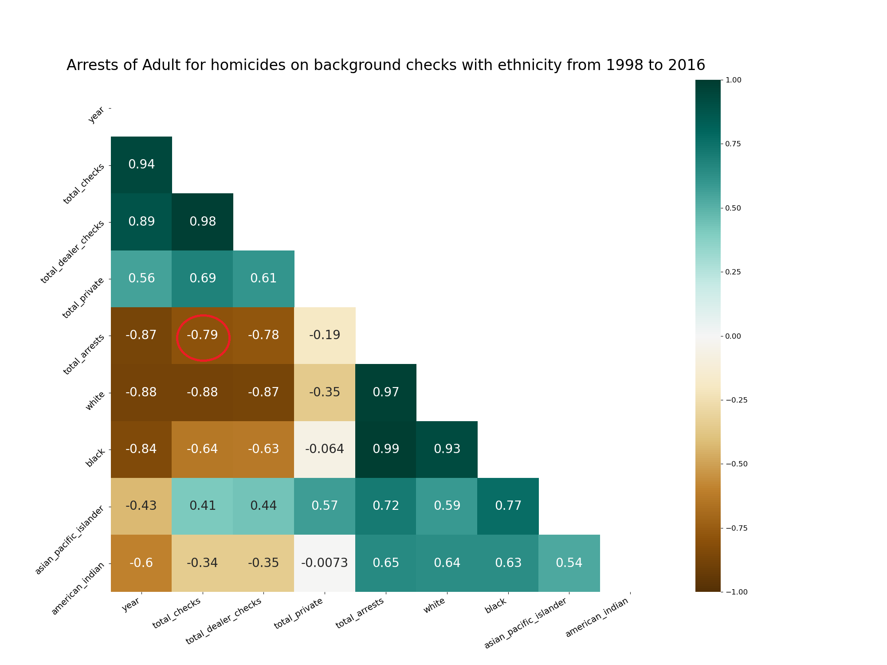

# 2021Fall_finals

Team Members:

1. Sahit Potnuru (potnuru3), GitHub: sahit10
2. Vanika Gupta (vanikag2), GitHub: VanikaGupta95

## Team Members:
1.	Sahit Potnuru (potnuru3), GitHub: sahit10
2.	Vanika Gupta (vanikag2), GitHub: VanikaGupta95
## Effectiveness of background checks on crime rates in US
Background checks for gun purchases are designed to prevent access to guns by convicted felons and other prohibited possessors. About 1 in 5 gun transactions in the U.S. occur without a background check, according to a 2017 study by researchers at Harvard and North-eastern University.

Though more than 90% of the American public supports background checks for all gun sales, a dangerous and deadly loophole in federal gun laws still exempts unlicensed sellers from having to perform any background check whatsoever before selling a firearm. With this loophole, guns easily find their way into the hands of illegal buyers and gun traffickers, dramatically increasing the likelihood of gun homicides and violent crimes.

Universal background check may reduce gun-related homicides or violent crimes by deterring prohibited possessors from attempting to acquire firearms or by making it harder or more expensive for them to succeed in doing so.

## Project Goal:
Crime rates are proportional to the firearm background checks processed through the National Instant Criminal Background Check System (NICS). It is necessary that background checks must be conducted before possessing a firearm. We have considered five data sets:

•	NICS firearm background checks from 1998 to 2021

•	Crimes committed by adults in the age group 18 to 65 years from 1994 till 2016.

•	Crimes committed by juveniles in the age group 0 to 17 years 1994 till 2016.

•	Total firearm homicide incidents from 2014 till 2020.

•	Violent crime incidents from 1998 to 2020.

Being a Type 1 project, based on the above datasets we will be analysing the conclusions stated in the research papers mentioned in References. Following are the conclusions.

#### Conclusion 1: Effect of background checks on violent crimes is inconclusive. 

#### Conclusion 2: Background checks may reduce firearm homicides and private-seller background checks on firearm homicides is inconclusive.

Six studies examined the overall effect of dealer background checks on firearm homicide rates: Two used large independent data sets and found significant effects indicating that dealer background checks reduce firearm homicides

One analysis found significant effects consistent with private-seller checks increasing firearm homicides, although these estimates became uncertain or significant in the opposite direction in different specifications. Another study found suggestive effects consistent with private-seller checks increasing firearm intimate partner homicides.

## Conclusion:
•	Total Background checks are highly negatively correlated with total violent crimes committed as seen below:

Now only considering California, Colorado, Delaware, Maryland, Nevada, New Jersey, New York, Oregon, Vermont, and Washington where background checks are mandatory. Firearm transfers are conducted by or processed through licensed dealers, who conduct background checks on prospective firearm purchasers or recipients.

Total Background checks are highly negatively correlated with total violent crimes committed as seen in the below plot:

Hence, we can conclude that an Increase in the background checks will decrease the rate of violent crimes.

•	Dealer background checks are slightly negatively corelated with total number of homicides, Private seller background checks are slighlty positively correlated with total number of homicides also Total Checks are almost showing very less to no correlation with homicides as seen below:

 

Hence, Conclusion 2 stated above is accurate. 

## Future Scope and Analysis:

We have further analysed the following:

•	Effectiveness of background checks on violent crimes and homicides based on ethnicity i.e., for White, Black, Pacific Asian, and American Indian. 
  
 
 
 
 
 
 
 
 
 
 
 
  

## Limitations:

## References:
1.	https://www.rand.org/research/gun-policy/analysis/background-checks.html#fn2
2.	https://wamu.org/story/20/06/25/do-universal-background-checks-prevent-gun-violence/
3.	https://www.rand.org/research/gun-policy/analysis/background-checks/violent-crime.html
4.	https://www.rand.org/research/gun-policy/analysis.html
5.	https://giffords.org/lawcenter/gun-laws/policy-areas/background-checks/universal-background-
6.	https://www.gunviolencearchive.org/last-72-hours
7.	https://medium.com/@szabo.bibor/how-to-create-a-seaborn-correlation-heatmap-in-python-834c0686b88e

